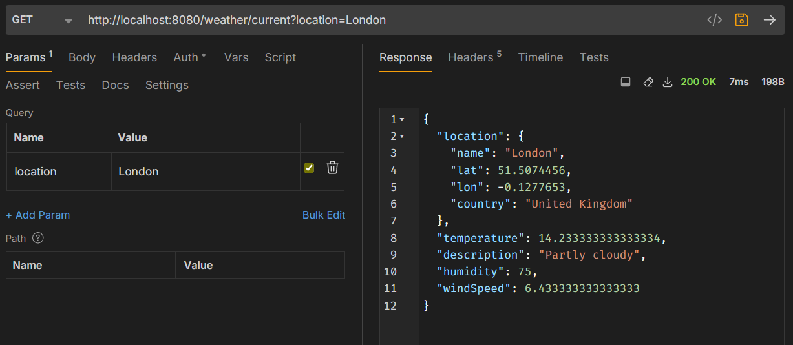
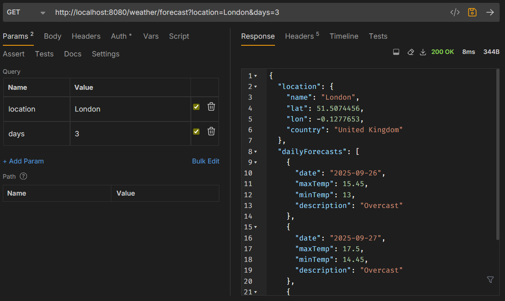
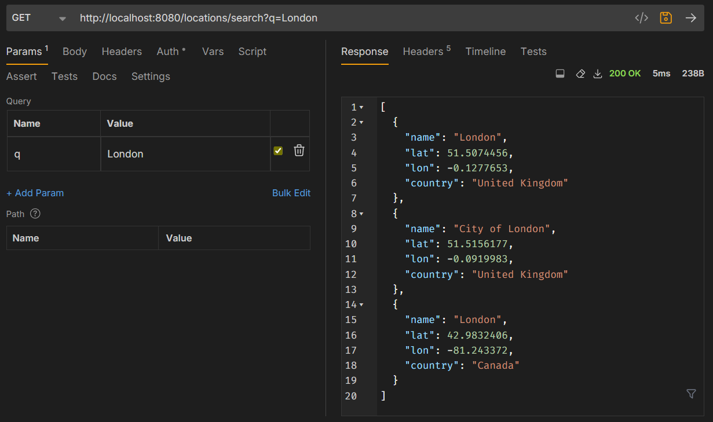
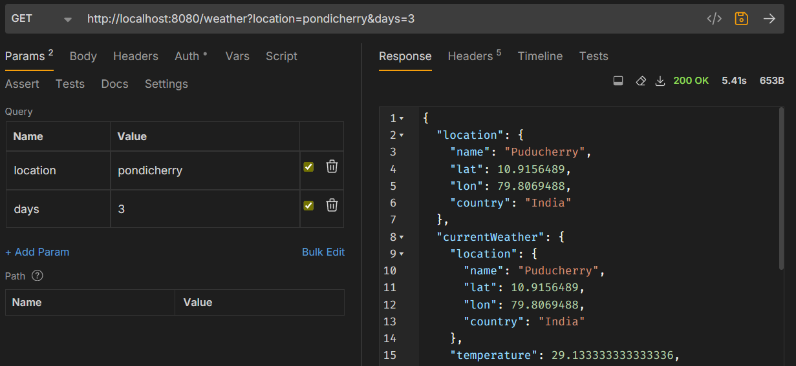
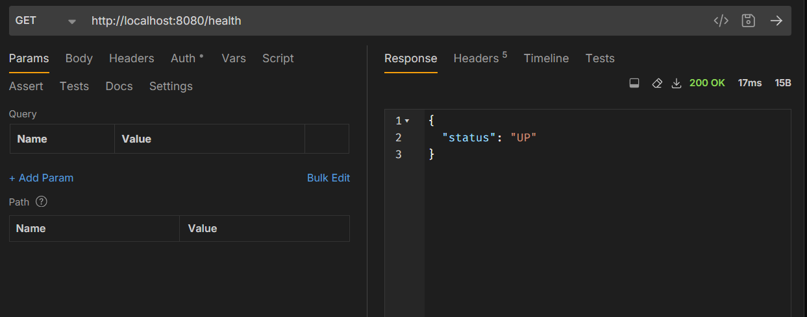

# 🌤️ Weather API - RESTful Weather Data Aggregator


A robust, production-ready RESTful API that aggregates weather data from multiple providers including OpenMeteo, WeatherAPI.com, Tomorrow.io, 7Timer!, and wttr.in. Built with Spring Boot 3.3.4 and Java 21, featuring comprehensive caching, rate limiting, and extensive API documentation.

## 🚀 Features

- **Multi-Provider Integration**: Aggregates data from 5+ weather service providers
- **Smart Caching**: Caffeine-based caching with configurable TTL (10 minutes default)
- **Rate Limiting**: IP-based rate limiting with Spring Security Filter chain
- **Location Search**: Intelligent location resolution and search
- **Comprehensive API Documentation**: Swagger/OpenAPI 3.0 integration
- **Production Ready**: Health checks, actuator endpoints, and monitoring
- **Error Handling**: Graceful error handling with detailed error responses
- **Security**: Spring Security integration with configurable authentication
- **Validation**: Request validation with detailed error messages

## 📋 Table of Contents

- [Quick Start](#-quick-start)
- [API Endpoints](#-api-endpoints)
- [Screenshots](#-screenshots)
- [Installation](#-installation)
- [Configuration](#-configuration)
- [Building & Running](#-building--running)
- [API Documentation](#-api-documentation)
- [Architecture](#-architecture)
- [Testing](#-testing)
- [License](#-license)

## ⚡ Quick Start

### Prerequisites

- **Java 21**
- **Maven 3.6+** 
- **Internet connection** (for external weather API calls)

### Run with Maven

```bash
# Clone the repository
git clone https://github.com/Ashwin-Ash-09/weatherapi.git
cd weatherapi

# Run the application
mvn spring-boot:run
```

The API will be available at `http://localhost:8080`

### API Health Check

```bash
curl http://localhost:8080/health
```

## 🛠️ API Endpoints

### Weather Endpoints

| Endpoint | Method | Description | Parameters |
|----------|--------|-------------|------------|
| `/weather/current` | GET | Get current weather for a location | `location` (required) |
| `/weather/forecast` | GET | Get weather forecast | `location` (required), `days` (1-7) |
| `/weather` | GET | Get complete weather data | `location` (required), `days` (1-7, default: 1) |

### Location Endpoints

| Endpoint | Method | Description | Parameters |
|----------|--------|-------------|------------|
| `/locations/search` | GET | Search for locations | `query` (required) |

### Health & Monitoring

| Endpoint | Method | Description |
|----------|--------|-------------|
| `/health` | GET | Application health status |
| `/actuator/health` | GET | Detailed health information |
| `/swagger-ui.html` | GET | Interactive API documentation |

### Example API Calls

**Get Current Weather:**
```bash
curl "http://localhost:8080/weather/current?location=London"
```

**Get 3-Day Forecast:**
```bash
curl "http://localhost:8080/weather/forecast?location=New York&days=3"
```

**Search Locations:**
```bash
curl "http://localhost:8080/locations/search?q=Paris"
```

## 📸 Screenshots

### Current Weather API Response


### Weather Forecast Response


### Location Search Response


### Complete Weather Data Response


### Health Check Response


## 📥 Installation

### Method 1: Clone and Run

```bash
# Clone the repository
git clone https://github.com/Ashwin-Ash-09/weatherapi.git
cd weatherapi

# Install dependencies and run
mvn clean install
mvn spring-boot:run
```

### Method 2: Download JAR

```bash
# Build the JAR file
mvn clean package

# Run the JAR file
java -jar target/weather-api-0.0.1-SNAPSHOT.jar
```


## ⚙️ Configuration

### Application Properties

The application can be configured via `src/main/resources/application.properties`:

```properties
# Server Configuration
server.port=8080
spring.application.name=weatherapi

# Cache Configuration
weather.cache.ttl=600  # Cache TTL in seconds (10 minutes)

# Logging Configuration
logging.level.com.ashwin.weatherapi=INFO
logging.level.org.springframework.cache=TRACE

# API Keys (Optional - some providers work without keys)
tomorrow.io.api.key=YOUR_TOMORROW_IO_API_KEY
weather.api.com.api.key=YOUR_WEATHER_API_COM_KEY

# Rate Limiting Configuration
rate.limit.requests=10
rate.limit.window.seconds=60
```

### Environment Variables

You can also configure the application using environment variables:

```bash
export SERVER_PORT=8080
export WEATHER_CACHE_TTL=600
export TOMORROW_IO_API_KEY=your_key_here
export WEATHER_API_COM_API_KEY=your_key_here
```

### Profile-based Configuration

The application supports multiple profiles:

- **dev**: Development profile with detailed logging
- **test**: Testing profile with mock data
- **prod**: Production profile with optimized settings

```bash
# Run with specific profile
mvn spring-boot:run -Dspring-boot.run.profiles=prod
```

## 🔨 Building & Running

### Build Commands

```bash
# Clean and compile
mvn clean compile

# Run tests
mvn test

# Package application
mvn clean package

# Skip tests during packaging
mvn clean package -DskipTests

# Install to local repository
mvn clean install
```

### Running the Application

**Option 1: Maven Spring Boot Plugin**
```bash
mvn spring-boot:run
```

**Option 2: Java JAR execution**
```bash
# Build first
mvn clean package

# Run the JAR
java -jar target/weather-api-0.0.1-SNAPSHOT.jar
```

**Option 3: IDE Integration**
- Import as Maven project in IntelliJ IDEA or Eclipse
- Run `WeatherapiApplication.java` main method

### Build Outputs

After building, you'll find:
- **JAR file**: `target/weather-api-0.0.1-SNAPSHOT.jar`
- **Test reports**: `target/surefire-reports/`
- **Code coverage**: `target/site/jacoco/` (if JaCoCo is configured)

## 📚 API Documentation

### Interactive Documentation

Once the application is running, visit:
- **Swagger UI**: [http://localhost:8080/swagger-ui.html](http://localhost:8080/swagger-ui.html)

### Sample API Responses

**Current Weather Response:**
```json
{
  "location": {
    "name": "London",
    "country": "United Kingdom",
    "latitude": 51.5074,
    "longitude": -0.1278
  },
  "temperature": 18.5,
  "description": "Partly cloudy",
  "humidity": 65,
  "windSpeed": 12.5,
  "pressure": 1013.2,
  "timestamp": "2024-09-27T09:20:00Z"
}
```

**Forecast Response:**
```json
{
  "location": {
    "name": "London",
    "country": "United Kingdom"
  },
  "forecast": [
    {
      "date": "2024-09-27",
      "maxTemp": 22.0,
      "minTemp": 15.0,
      "description": "Sunny",
      "humidity": 60,
      "windSpeed": 10.0
    }
  ]
}
```

### Error Responses

**Location Not Found (404):**
```json
{
  "error": "Location not found: InvalidCity"
}
```

**Rate Limit Exceeded (429):**
```json
{
  "error": "Too many requests."
}
```

## 🏗️ Architecture

### Project Structure

```
src/
├── main/
│   ├── java/com/ashwin/weatherapi/weatherapi/
│   │   ├── WeatherapiApplication.java      # Main application class
│   │   ├── controller/                      # REST controllers
│   │   │   ├── WeatherController.java       # Weather endpoints
│   │   │   ├── LocationController.java      # Location endpoints  
│   │   │   └── HealthController.java        # Health check endpoint
│   │   ├── service/                         # Business logic services
│   │   │   ├── WeatherService.java          # Weather data aggregation
│   │   │   └── LocationService.java         # Location resolution
│   │   ├── provider/                        # Weather data providers
│   │   │   ├── OpenMeteoService.java        # OpenMeteo integration
│   │   │   ├── WeatherApiComService.java    # WeatherAPI.com integration
│   │   │   ├── TomorrowIoService.java       # Tomorrow.io integration
│   │   │   ├── SevenTimerService.java       # 7Timer! integration
│   │   │   └── WttrInService.java          # wttr.in integration
│   │   ├── model/                          # Data models
│   │   │   ├── CurrentWeather.java         # Current weather model
│   │   │   ├── Forecast.java               # Forecast model
│   │   │   ├── Location.java               # Location model
│   │   │   └── WeatherResponse.java        # Combined response model
│   │   ├── config/                         # Configuration classes
│   │   │   └── SecurityConfig.java         # Security configuration
│   │   └── exception/                      # Exception handling
│   └── resources/
│       ├── application.properties          # Application configuration
│       └── META-INF/                       # Additional metadata
├── test/                                   # Test classes
└── screenshots/                            # API response screenshots
```

### Key Technologies

- **Spring Boot 3.3.4**: Core framework
- **Java 21**: Programming language
- **Caffeine Cache**: High-performance caching
- **Spring Security**: Authentication and authorization
- **SpringDoc OpenAPI**: API documentation
- **Lombok**: Boilerplate reduction
- **Spring WebFlux**: Reactive web client
- **JaCoCo**: Code coverage
- **Maven**: Build automation

### Design Patterns

- **Service Layer Pattern**: Separation of business logic
- **Provider Pattern**: Multiple weather data sources
- **Repository Pattern**: Data access abstraction
- **Strategy Pattern**: Different caching strategies
- **Factory Pattern**: Weather provider instantiation


## 👨‍💻 Author

**Ashwin** - [GitHub Profile](https://github.com/Ashwin-Ash-09)

## 🙏 Acknowledgments

- **OpenMeteo**: Free weather API service
- **WeatherAPI.com**: Comprehensive weather data
- **Tomorrow.io**: Advanced weather intelligence
- **7Timer!**: Numerical weather prediction
- **wttr.in**: Console weather service
- **Spring Boot Community**: Excellent framework and documentation

## 🔗 Links

- **Repository**: [https://github.com/Ashwin-Ash-09/weatherapi](https://github.com/Ashwin-Ash-09/weatherapi)
- **Issues**: [Report a bug or request a feature](https://github.com/Ashwin-Ash-09/weatherapi/issues)
- **API Documentation**: [Swagger UI](http://localhost:8080/swagger-ui.html) (when running)

---

⭐ **Star this repository if you find it helpful!**

## 📈 Performance & Monitoring

### Caching Strategy

- **Cache TTL**: 10 minutes (configurable)
- **Cache Provider**: Caffeine (high-performance)
- **Cache Keys**: Location-based with coordinate precision
- **Cache Eviction**: Time-based and size-based

### Rate Limiting

- **Default Limit**: 10 requests per minute per IP
- **Response**: HTTP 429 when limit exceeded
- **Configuration**: Adjustable via application properties

### Monitoring Endpoints

```bash
# Application health
curl http://localhost:8080/actuator/health

```

### Production Deployment

For production deployment, consider:

1. **Environment Variables**: Use external configuration
2. **Load Balancing**: Deploy behind a load balancer
3. **Database**: Consider persistent caching with Redis
4. **Monitoring**: Integrate with Prometheus/Grafana
5. **Logging**: Configure structured logging with ELK stack
6. **Security**: Enable HTTPS and proper authentication

---

*Last updated: September 27, 2024*